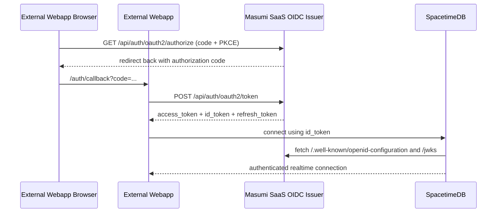

# External Webapp OIDC Integration

This document explains how an external webapp should integrate with the OIDC issuer exposed by `masumi-saas`, and how that token set should be used with SpacetimeDB.

It is written for the separate webapp repo so the implementation there can be done without having to rediscover the auth contract from this repo.

## Summary

- `masumi-saas` is the single auth server and OIDC issuer.
- The external webapp is a public OIDC client.
- The external webapp should use Authorization Code + PKCE.
- The webapp should use the returned `id_token` when connecting to SpacetimeDB.
- The webapp should use the returned `access_token` when calling Masumi SaaS APIs.
- SpacetimeDB should trust the Masumi issuer and validate `iss`, `aud`, and expiry.
- The CLI also uses the same issuer, but through the device flow.

## Current Contract

Masumi SaaS exposes these public endpoints:

- Discovery: `GET /.well-known/openid-configuration`
- OAuth metadata: `GET /.well-known/oauth-authorization-server`
- JWKS: `GET /jwks`
- Authorization endpoint: `GET /api/auth/oauth2/authorize`
- Token endpoint: `POST /api/auth/oauth2/token`
- UserInfo endpoint: `GET /api/auth/oauth2/userinfo`
- End-session endpoint: `GET /api/auth/oauth2/endsession`
- Device authorization endpoint: `POST /api/auth/device/code`

Default trusted public client IDs:

- Webapp: `masumi-spacetime-web`
- CLI: `masumi-spacetime-cli`

Important behavior:

- The webapp flow is standard OIDC Authorization Code + PKCE.
- The CLI flow is standard device authorization.
- The token endpoint accepts the device-code grant at `POST /api/auth/oauth2/token`.
- The legacy alias `POST /api/auth/device/token` still works, but new clients should use `/api/auth/oauth2/token`.
- SpacetimeDB should use the `id_token`, not the `access_token`.
- Masumi SaaS APIs should use the `access_token`, not the `id_token`.
- Masumi signs `id_token`s with `ES256` and exposes matching EC keys at `GET /jwks`.
- Refresh-token exchanges also return a fresh `id_token`, so changed claims such as `email_verified` are reflected after refresh.
- API scopes are granted as `requested ∩ stored user grants ∩ client allowlist`.

## Values The Other Repo Needs

The external webapp should be configured with:

```env
MASUMI_OIDC_ISSUER=https://your-saas-domain.com
MASUMI_OIDC_CLIENT_ID=masumi-spacetime-web
MASUMI_OIDC_REDIRECT_URI=https://your-webapp-domain.com/auth/callback
MASUMI_OIDC_POST_LOGOUT_REDIRECT_URI=https://your-webapp-domain.com/
```

The SaaS repo must allow that callback URL:

- `OIDC_WEB_REDIRECT_URLS` must include the exact redirect URI used by the external webapp.

If the external webapp wants to use the bridge endpoint as a fallback:

- its origin must be allowed by `OIDC_WEB_REDIRECT_URLS` or `CORS_ALLOWED_ORIGINS`

## Recommended Integration Shape

For the external webapp, the recommended flow is:

1. Redirect the user to the Masumi authorization endpoint.
2. Complete Authorization Code + PKCE.
3. Exchange the code at the Masumi token endpoint.
4. Store the token set in the webapp auth layer.
5. Use the `id_token` for SpacetimeDB.
6. Use the `access_token` for scoped Masumi SaaS API calls.
7. Refresh tokens before expiry.

Do not use cookie-protected SaaS app routes from the external webapp.

Do not use the bridge endpoint as the primary login strategy for the external webapp unless you intentionally want a Masumi-session-based integration instead of a full OIDC client.

## Token Semantics

Current token expectations:

- `id_token` is the identity token that SpacetimeDB should receive
- `access_token` is the bearer token that Masumi SaaS APIs should receive
- `refresh_token` should be used to renew the token set when available

Current Masumi API scopes:

- `agents:read:preprod`, `agents:write:preprod`, `agents:read:mainnet`, `agents:write:mainnet`
- `credentials:read:preprod`, `credentials:write:preprod`, `credentials:read:mainnet`, `credentials:write:mainnet`
- `activity:read:preprod`, `activity:read:mainnet`
- `earnings:read:preprod`, `earnings:read:mainnet`
- `dashboard:read:preprod`, `dashboard:read:mainnet`

Important claims in the `id_token`:

- `iss`: Masumi issuer URL
- `sub`: stable Masumi user ID
- `aud`: the OIDC client ID
- `exp`
- `iat`
- optional `nbf`
- `email`
- `email_verified`
- `name`
- `picture`

Important header behavior:

- `alg`: `ES256`
- `kid`: current Masumi JWKS key ID

Important consequence:

- for the external webapp, `aud` will be `masumi-spacetime-web` by default
- for the CLI, `aud` will be `masumi-spacetime-cli`

SpacetimeDB should trust those client IDs, or whatever client IDs are configured in production.

## End-to-End Flow



## Webapp Implementation Notes

### Option A: TanStack Start with server-side callback handling

This is the preferred setup.

- Start login from the browser.
- Handle the callback on the webapp server.
- Exchange the code for tokens on the server.
- Store refresh token server-side or in a secure cookie strategy owned by the webapp.
- Expose the current `id_token` to the browser only when needed for SpacetimeDB.

This gives the webapp better control over refresh, logout, and token storage.

### Option B: Pure browser PKCE client

This also works, but storage is harder.

- Keep tokens in memory when possible.
- If persistence is needed, be careful with long-lived token storage in browser storage.
- Refresh before expiry and clear tokens fully on logout.

## Example OIDC Parameters

Authorization request:

```text
GET {issuer}/api/auth/oauth2/authorize
  ?response_type=code
  &client_id=masumi-spacetime-web
  &redirect_uri=https%3A%2F%2Fyour-webapp-domain.com%2Fauth%2Fcallback
  &scope=openid%20profile%20email%20offline_access
  &state=...
  &code_challenge=...
  &code_challenge_method=S256
```

Token exchange:

```text
POST {issuer}/api/auth/oauth2/token
Content-Type: application/x-www-form-urlencoded

grant_type=authorization_code
client_id=masumi-spacetime-web
code=...
redirect_uri=https%3A%2F%2Fyour-webapp-domain.com%2Fauth%2Fcallback
code_verifier=...
```

Refresh:

```text
POST {issuer}/api/auth/oauth2/token
Content-Type: application/x-www-form-urlencoded

grant_type=refresh_token
client_id=masumi-spacetime-web
refresh_token=...
```

The refresh response includes a newly issued `id_token` in addition to the rotated `access_token` / `refresh_token`.

## SpacetimeDB Integration

The external webapp should pass the `id_token` into the SpacetimeDB client connection.

Conceptually:

```ts
const tokenSet = await getMasumiTokenSet();
const spacetimeToken = tokenSet.id_token;

await connectToSpacetimeDb({
  token: spacetimeToken,
});
```

SpacetimeDB must validate:

- issuer matches Masumi issuer
- audience matches the trusted client ID for the caller
- token is not expired
- signature verifies against Masumi JWKS

If you are upgrading a local Masumi issuer from an older `EdDSA` setup, clear the local auth DB or at least the `jwks` table before retesting. Better Auth reuses the latest stored signing key until it is rotated or removed.

For the external webapp, that means the SpacetimeDB trust configuration should accept:

- `masumi-spacetime-web`

For CLI access, it should also accept:

- `masumi-spacetime-cli`

## Logout

The external webapp logout should do all of the following:

1. Clear local token state.
2. Clear any server-side session owned by the external webapp.
3. Redirect to the Masumi end-session endpoint if RP-initiated logout is part of the UX.

Current end-session endpoint:

- `GET /api/auth/oauth2/endsession`

## Recommended Library Choice

Use any standards-compliant OIDC client.

Good approach:

- if the TanStack Start server handles callback and refresh, use a server-capable OIDC client
- if the browser handles PKCE directly, use a browser-capable OIDC client

The important part is not the specific library. The important part is:

- Authorization Code + PKCE
- `client_id = masumi-spacetime-web`
- exact redirect URI match
- use `id_token` for SpacetimeDB

## Alternate Bridge-Based Integration

Masumi also exposes:

- `POST /api/oidc/spacetimedb/token`

This endpoint exchanges an already-authenticated Masumi session into an OIDC token set.

Use this only if the external webapp is intentionally relying on a Masumi session cookie or Masumi bearer session token already obtained by some other flow.

For a standalone external webapp repo, full OIDC Authorization Code + PKCE is still the recommended integration.

## CLI Context

The CLI is separate from the external webapp, but the other repo should know the CLI contract because SpacetimeDB will see both audiences.

CLI flow:

1. `POST /api/auth/device/code`
2. user approves at `/device`
3. CLI polls `POST /api/auth/oauth2/token` with `grant_type=urn:ietf:params:oauth:grant-type:device_code`
4. token response contains `id_token`
5. CLI uses that `id_token` for SpacetimeDB

This means SpacetimeDB should trust both:

- `masumi-spacetime-web`
- `masumi-spacetime-cli`

## Production Checklist

- Set `OIDC_PUBLIC_ISSUER_URL` correctly in `masumi-saas`
- Set `OIDC_WEB_CLIENT_ID` if you are not using the default
- Set `OIDC_WEB_REDIRECT_URLS` to the exact external webapp callback URL
- Configure the external webapp with the same issuer, client ID, and redirect URI
- Make sure SpacetimeDB trusts the Masumi issuer and JWKS
- Make sure SpacetimeDB accepts the relevant client IDs in `aud`
- Refresh tokens before expiry
- Use `id_token` for SpacetimeDB, not `access_token`

## What Has Been Verified In This Repo

The current implementation has been verified live for:

- OIDC discovery
- JWKS endpoint
- external webapp OIDC token exchange path
- Spacetime bridge
- standard CLI device-code flow through `/api/auth/oauth2/token`
- legacy compatibility alias `/api/auth/device/token`

## If The Other Repo Needs A Minimal Decision

Use this:

- issuer: Masumi SaaS
- flow: Authorization Code + PKCE
- client ID: `masumi-spacetime-web`
- scopes: `openid profile email offline_access`
- token for SpacetimeDB: `id_token`
